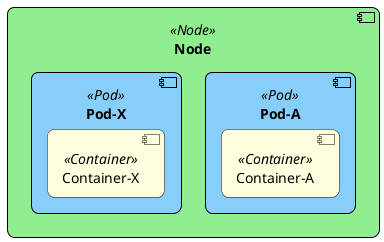
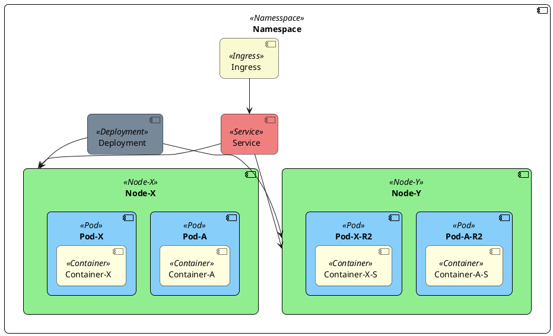
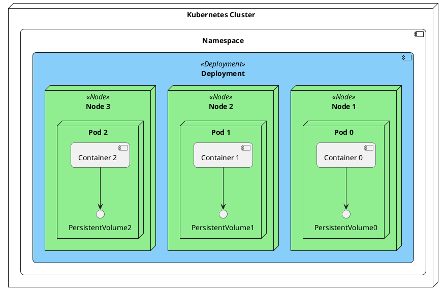
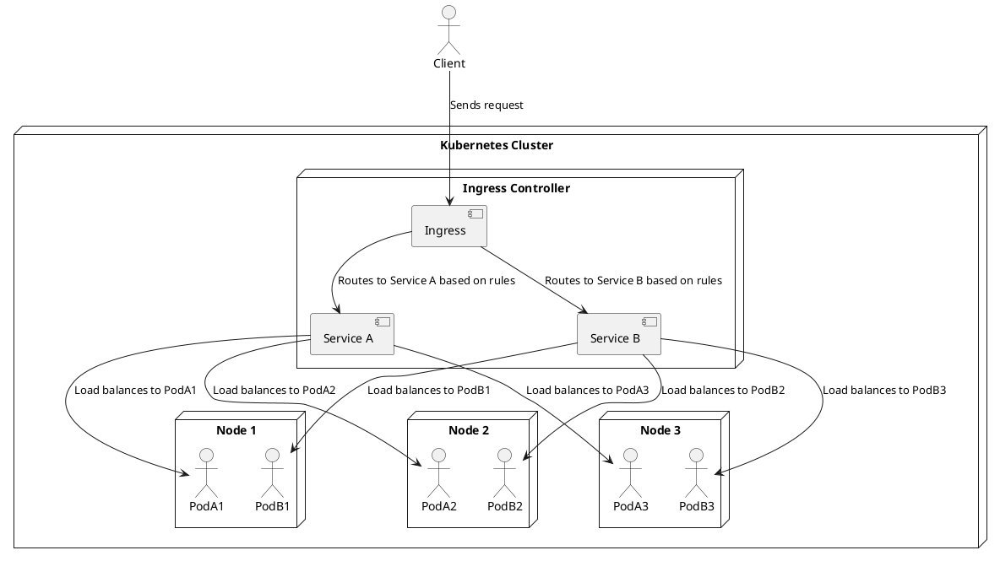

# Why Kubernetes

- Service discovery and load balancing (*DNS*)
- Storage orchestration (*Nodes*)
- Automated rollouts and rollbacks (*Manifests*)
- Automatic bin packing (*CPU*, *RAM*, ...)
-  Self-healing (*Events*)
- Secret and configuration management
- Batch execution
- Horizontal scaling (*Repicas*, ...)
- IPv4/IPv6 dual-stack
- Designed for extensibility (*Custom Resources*)

---
transition: slide-left
layout: default
---
# What kubernetes is not

- No limits on workload (Hmm... RTP?)
- Does not deploy source code and does not build your application.
- Does not provide application-level services.
- Does not dictate logging, monitoring, or alerting solutions
- Does not provide nor mandate a configuration language/system.
- Does not provide nor adopt any comprehensive machine configuration, maintenance, management, or self-healing systems.
- Additionally, Kubernetes is not a mere orchestration system. In fact, it eliminates the need for orchestration.

---
transition: slide-left
layout: image
image: './images/components-of-kubernetes.svg'
backgroundSize: contain
---

---
transition: slide-left
layout: two-cols
---
# Components

## Control-Plane

- kube-api-server
- etcd
- kube-scheduler
- kube-controller-manager

## Node-Services

- kubelet
- kube-proxy
- Container runtime (containerd, CRI-O, WebAssembly,...)

::right::

# Addons

- DNS (coreDNS)
- CNI (container network interface | SDN) (calico)
 - Traffic shaping, eBPF, ... 
- Custom-Services like monitoring 

---
transition: slide-left
layout: default
---
# Kubernetes Node
- self-registration (on API-Service)
- cloud-provider support (get metadata about itself)
- IP4/IP6 IPs management
- Labels support (e.g. for GPU-Nodes)
- Health monitoring
- Cordon support ("unschedulable")
- Drain support
- Resource tracking (CPU/RAM)

---
transition: slide-left
layout: default
---

# Node Examples
- kubectl get nodes
- kubectl get nodes -o wide
- kubectl describe node apps-2024-06-pool2-5gpd5bnv6l
- kubectl cordon node-name
- kubectl drain node-name
- kubectl label nodes node-name label-key=label-value
- kubectl top node apps-2024-06-pool2-5gpd5bnv6l
- kubectl rollout restart node node-name
- kubectl get events --all-namespaces

---
transition: slide-left
layout: two-cols
---

# Pod/Container
- Environment variables and PVs access
- Status:
  - Scheduled, Pulled, Pulling, Started, Killing, Backoff, ...
- Events:
  - Logs occurred statues (e.g. started...) 
- Hooks:
  - PostStart, PreStop, Readiness, Healthy, ...
- Sidecars (Init-Container, DAPR-Sidecar, ...)
- Resources:
  - Limits and **Requests** (CPU, RAM)
- Pod Topology Spread Constraints
  - maxSkew, topologyKey, labelSelector, ...

::right::

<arrow v-click x1="510" y1="210" x2="230" y2="450" color="red" width="2" arrowSize="1" />

---
transition: slide-left
layout: default
---

# Pod Examples
- kubectl get pods
- kubectl get pods --namespace staging
- kubectl describe pod meeting-service-578d8f55b6-552bl
- kubectl logs meeting-service-578d8f55b6-552bl
- kubectl logs -lapp=meeting-service
- kubectl delete pod meeting-service-578d8f55b6-552bl
- kubectl exec -it pod-name -n namespace -- /bin/bash
- kubectl get pods --all-namespaces --field-selector spec.nodeName=meeting-service

---
transition: slide-left
layout: two-cols
---

# Kubernetes Objects
- Node, Pod, Container
- More:
  - Namespace
  - Provision-Objects: *Stateful-Sets*, *Deployment*
  - Routing-Objects: *Service*, *Ingress*, *Gateway?*
  - Config-Objects: *Config Map*, *Secret*
  
::right::

<arrow v-click x1="610" y1="80" x2="190" y2="200" color="red" width="2" arrowSize="1" />

---
transition: slide-left
layout: default
---
# Namespaces
**Namespaces** are used to logically divide and isolate resources within a cluster. 
They allow multiple teams or applications to coexist within the same cluster by providing separate environments.
This helps in organizing resources, avoiding naming conflicts, and enforcing security and access controls.
Namespaces enable efficient resource management and allow for setting limits,
such as CPU or memory quotas, within each isolated environment.
Thus, they enhance scalability and manageability in large clusters by partitioning resources logically
without requiring separate physical clusters.
- RBAC security and policies
- Support by the DNS system (isolation - e.g. ping hostname, simple Service-Discovery)

kubectl get namespaces

---
transition: slide-left
layout: two-cols
---
# Deployments
**Deployments** are used to manage and maintain stateless applications by defining how many replicas (instances) of a Pod should be running at any given time.
A Deployment ensures that a specified number of identical Pods are running,
automatically restarting failed Pods and managing updates or rollbacks without downtime.

It provides features such as scaling, rolling updates, and rollback capabilities, allowing for controlled and easy management of application lifecycle and
versioning. Deployments are ideal for workloads where Pods are interchangeable and do not require persistent state.

::right::

---
transition: slide-left
layout: two-cols
---
# Statefull-Sets
A StatefulSet is used to manage stateful applications that require stable, 
unique network identities and persistent storage. Unlike regular Deployments where pods are interchangeable, 
StatefulSets ensure that each pod has a fixed identity, ordered deployment and termination, and persistent storage volumes 
that retain data even if the pod is restarted. This makes it ideal for managing databases and other stateful services.
In addition, the DNS pod names are defined and numbered sequentially.

### Useful for
- Databases
- Cluster (Service-Programms)
- Pub/Sub-Services

::right::

---
transition: slide-left
layout: two-cols
---
# Ingress & Service
A **Ingress** manages external access to services within the cluster, typically via HTTP/HTTPS. It defines rules for routing traffic to specific services based on hostnames, paths, or other conditions. Ingress can also handle SSL termination and offer features like load balancing and virtual hosting, providing a more flexible and feature-rich alternative to exposing services through NodePort or LoadBalancer.

A **Service** provides a stable endpoint to access a set of Pods. It abstracts the underlying Pod IPs, which can change as Pods are created and destroyed, and ensures reliable communication within the cluster or externally. Services can load balance traffic across multiple Pods and offer different types like ClusterIP (internal access), NodePort (external access via node IP), and LoadBalancer (provider’s load balancer).

::right::

# Load-Balancing

 

- Load-Balancing
- TLS
- A Ingress-Controller is implemented by Traefik, NGINX, ...,  and hyperscaler LBs
- kubectl get service, kubectl get ingress

---
transition: slide-left
layout: default
---
# Configs and Secrets

**ConfigMaps** are used to store configuration data in key-value pairs. They allow you to 
decouple configuration
artifacts from container images, 
enabling you to configure applications dynamically without rebuilding container images. 
ConfigMaps can provide
environment variables, command-line arguments, or configuration files to your pods, 
helping manage application configuration in a more flexible and centralized manner.

 

**Secrets** are used to store sensitive information, such as passwords, tokens, or keys, in a secure way. 
Unlike ConfigMaps, which store non-sensitive data, Secrets ensure that confidential information is encoded and
only accessible to authorized pods.
This helps protect sensitive data from being exposed in plaintext within configuration files or environment variables,
allowing secure management of critical information in your applications.

- kubectl get configs
- kubectl get secrets
